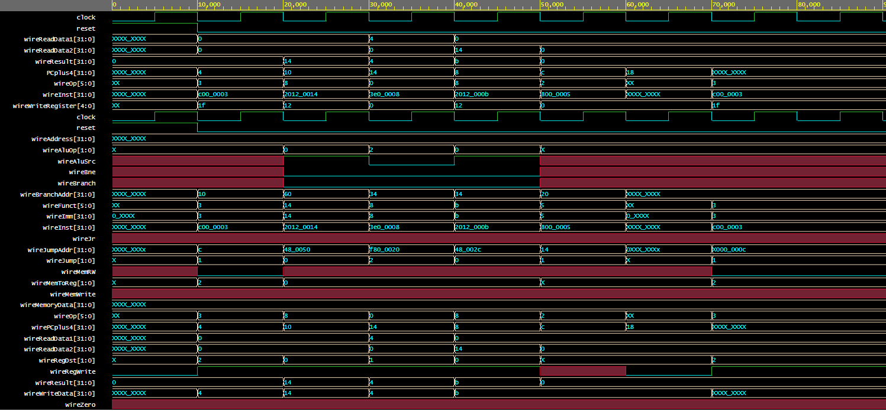

# MyRISKv1 - Processador Monociclo em MIPS

Descrição
Este projeto implementa um processador monociclo na arquitetura MIPS usando VHDL. O processador é capaz de executar algumas instruções básicas do conjunto de instruções MIPS tais como BNE, JR e JAL e foi desenvolvido em sala durante as aulas de Organização e Arquitetura de Computadores II, juntamente com o Professor Max Santana Rolemberg Farias da UNIVASF - Universidade Federal do Vale do São Francisco.

Pré-requisitos

Para compilar e simular o projeto, você precisará de um ambiente VHDL adequado (por exemplo, Xilinx Vivado, ModelSim), recomenda-se usar o  EDAPlayground (simulador online que suporta várias linguagens de descrição de hardware.).

Como Usar

Para usar o processador, siga os seguintes passos:
Clone este repositório.
Abra o projeto em seu ambiente de desenvolvimento VHDL.
Compile o código.
Simule o design usando testbenches fornecidos.

Simulação

Os resultados da simulação são gravados no diretório simulations/waveforms/. Analise esses resultados para verificar a correta execução das instruções.

