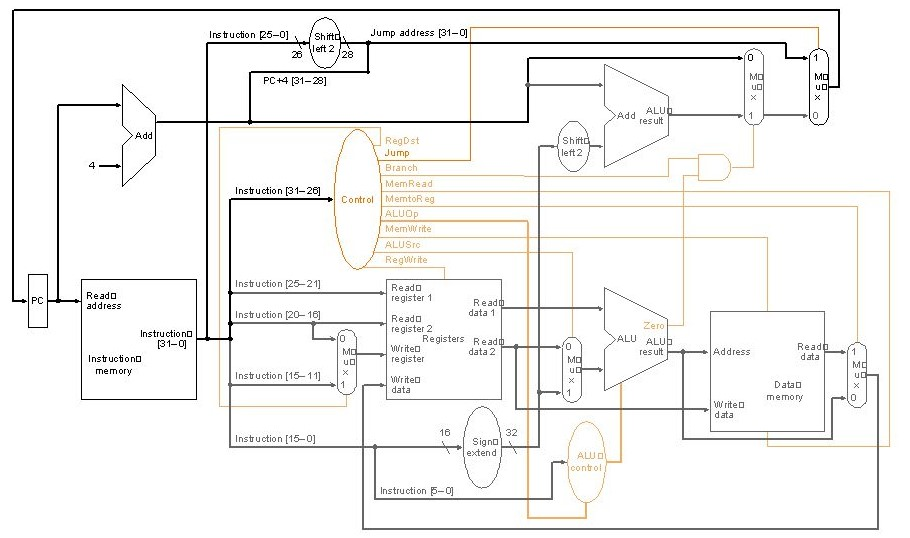

# MyRISKv1 - Processador Monociclo em MIPS

## Descrição

Este projeto implementa um processador monociclo na arquitetura MIPS usando VHDL. O processador é capaz de executar algumas instruções básicas do conjunto de instruções MIPS, como BNE, JR e JAL, e foi desenvolvido em sala durante as aulas de Organização e Arquitetura de Computadores II, juntamente com o amigo Lucas Emmanuel e o Professor Max Santana Rolemberg Farias da UNIVASF - Universidade Federal do Vale do São Francisco.

## Sobre
A arquitetura do processador myRISCv1 é um projeto baseado nos três formatos de instrução MIPS de 32 bits: Formato R; Formato I e Formato J. O design deste processador consiste em instruções de 32 bits. A implementação do myRISCv1 realiza busca, decodificação, e execução em um ciclo de clock. A arquitetura myRISCv1 é separada em cinco estágios: fetch (IF), busca de instrução, instruction decode (ID), decodificação de instrução, execute (EX), execução, data memory (Mem), acesso a memória de dados, e write back (WB), escrita de volta.

## Pré-requisitos

Para compilar e simular o projeto, você precisará de um ambiente VHDL adequado (por exemplo, Xilinx Vivado, ModelSim). Recomenda-se usar o EDAPlayground (simulador online que suporta várias linguagens de descrição de hardware).

## Como Usar

Para usar o processador, siga os seguintes passos:
1. Clone este repositório.
2. Abra o projeto em seu ambiente de desenvolvimento VHDL.
3. Compile o código.
4. Simule o design usando testbenches fornecidos.

## Datapath Monociclo

## Simulação

Os resultados da simulação são gravados no diretório `simulations/waveforms/`. Analise esses resultados para verificar a correta execução das instruções.

## WaveForm de um código que testa a instrução JAL e JR (./jal_and_jar_test.out)

